# 🚀 Spring Boot, Docker, and MongoDB Example

This repository demonstrates how to use Spring Boot with MongoDB inside Docker containers. You can either use Docker Compose for a one-command setup or manually start containers for more control.

---

## Prerequisites

- [Docker ](https://www.docker.com/get-started) installed

---

## 🗺️ Architecture Flow Diagram

Below is a simple flow diagram showing the interaction between the user, the Spring Boot application, and MongoDB, all running in Docker containers.

```mermaid
flowchart LR
    User([🧑 User])
    Browser([🌐 Browser or API Client])
    SpringBoot(["<img src='https://img.icons8.com/color/48/000000/spring-logo.png' width='32'/> Spring Boot App<br/>🐳 Docker Container"])
    MongoDB(["<img src='https://img.icons8.com/color/48/000000/mongodb.png' width='32'/> MongoDB<br/>🐳 Docker Container"])

    User -- "HTTP Request" --> Browser
    Browser -- "API Calls (GET/POST)" --> SpringBoot
    SpringBoot -- "Query/Save Data" --> MongoDB
    MongoDB -- "Data Response" --> SpringBoot
    SpringBoot -- "API Response" --> Browser
    Browser -- "Display Data" --> User
```



---

## 🐳 Running MongoDB in Docker

First, pull the latest MongoDB Docker image and run a container:

```bash
docker pull mongo:latest
docker run -d -p 27017:27017 --name manish172000mongodb mongo:latest
```
`manish172000mongodb` - container name (any name you can give)

---

## 🏗️ Building the Spring Boot Docker Image

Build the Spring Boot application's Docker image:

```bash
docker build -t spring-docker-mongodb:1.0 .
```

---

## 🏃‍♂️ Running the Spring Boot App Linked to MongoDB

You can run the Spring application container and link it to the running MongoDB container:

```bash
docker run -p 8080:8080 --name spring-docker-mongodb --link manish172000mongodb:mongo -d spring-docker-mongodb:1.0
```

---

## 🧩 Using Docker Compose (Recommended)

A `docker-compose.yml` file is included in `src/main/resources`. To start both the MongoDB and Spring Boot containers together, run:

```bash
cd src/main/resources
docker-compose up
```

This will spin up both services together, handling networking automatically.

---

## 📚 API Endpoints

### 🔍 Get All Books

```bash
curl --request GET \
  --url http://localhost:8080/get \
  --header 'User-Agent: insomnia/11.4.0'
```

**Response:**
```json
[
  {
    "id": 3,
    "name": "c programming",
    "author": "Bala guru swami"
  }
]
```

### ➕ Add a Book

```bash
curl --request POST \
  --url http://localhost:8080/save \
  --header 'Content-Type: application/json' \
  --header 'User-Agent: insomnia/11.4.0' \
  --data '{
    "id":3,
    "name":"c programming",
    "author":"Bala guru swami"
}'
```

**Response:**
```json
{
  "id": 3,
  "name": "c programming",
  "author": "Bala guru swami"
}
```

---

## 📝 Notes

- You can use either Docker Compose or the manual Docker commands above.
- The application will be available at [http://localhost:8080](http://localhost:8080) by default.
- Ensure that MongoDB is running before starting the Spring Boot app if you are not using Docker Compose.
---


Feel free to fork and adapt for your own projects!  
Made with ❤️, 🐳, and 🍃


